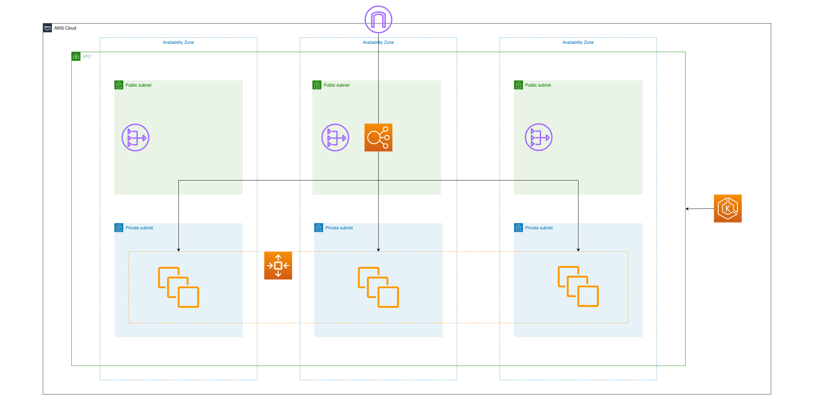

# AWS EKS Private Cluster 

## 構成図



## リソース構築

```bash
make apply
```

## Deployment・Service作成

```bash
aws eks --region <region> update-kubeconfig --name <cluster_name>
kubectl apply -f ./manifest.yml
```

## リソース削除

```bash
kubectl delete -f ./manifest.yml
make destroy
```
